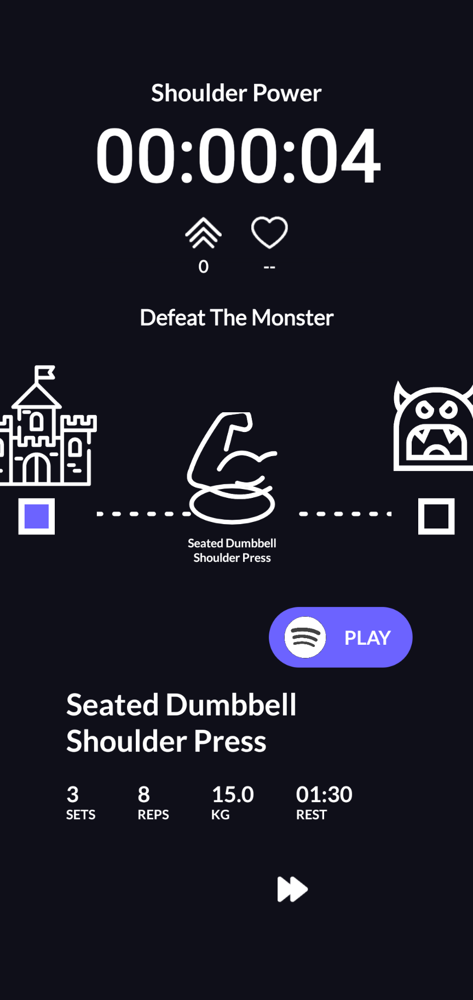

# Fitup - Your Ultimate Workout App

Fitup is a comprehensive workout app for Android that empowers you to create personalized workouts, track your progress with timers and gamification, and keep tabs on your health and exercise data.

## Features

- **Workout Creation and Editing**: Build your custom workouts from a vast selection of presets and custom exercises. Tailor your routine to your fitness goals.
- **Workout Tracking**: Effortlessly track your workouts with built-in timers and a gamified interface. Stay motivated as you crush your fitness goals.
- **Health and Exercise Data**: Keep a close eye on your health metrics, including weight, fat percentage, max reps in bench press, and more. Track your progress over time.
- **Custom Exercises**: Add your own exercises to the app, ensuring your workout plans are as unique as you are.
- **Pre-set Workouts and Exercises**: Get started quickly with pre-set workouts and exercises. Choose from a variety of options to kickstart your fitness journey.
- **Graphs and Data Tracking**: Visualize your progress with easy-to-read graphs and detailed data tracking. Understand how your efforts translate into results.

## Screenshots

  
  
  
  
  

## Documentation

[Here](<Presentation/DIMA - DD - Cassenti - Giannini - FITUP.pdf>) you can find the official documentation, including all the features and how to use the app.

## Copyright

© [2023] [nixetheus & Nicog97]. All rights reserved.

Unauthorized use, reproduction, or distribution of this repository or any of its files is prohibited. This repository is a collective work that may contain confidential, proprietary, and copyrighted information. Any use of the code, text, images, design elements, or other content found in this repository without explicit permission is strictly prohibited.

## Contact

For any questions or inquiries, feel free to reach out via email at luca \[dot\] cassenti \[at\] protonmail \[dot\] ch or on Github [@nixetheus](https://github.com/nixetheus) or [@Nicog97](https://github.com/Nicog97). 

_This project was developed as part of a university project, and contributions are not currently accepted._
